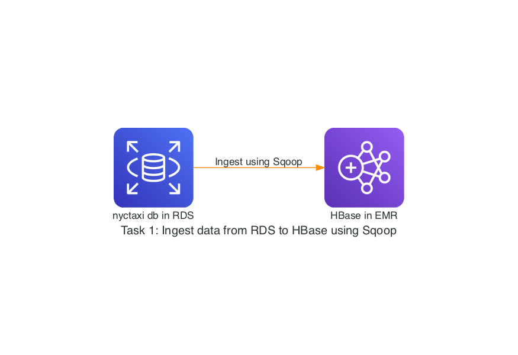
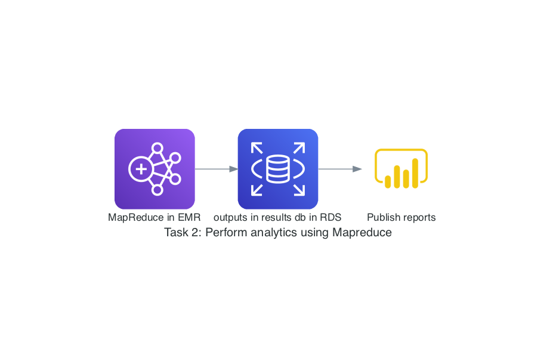

# ETL Project - NYC Taxi Data Analysis

## Overview

This repository contains the steps and code to perform ETL (Extract, Transform, Load) on NYC taxi data from the year 2017. The dataset is available for download and the process involves setting up the necessary infrastructure, importing data into a relational database, and then processing the data for analysis.

# Tools Required
1. AWS subscription for access to RDS, EMR.
2. Python 

## Data Source

The data set for this project can be downloaded from the following links:

1. [Jan 2017](https://nyc-tlc-upgrad.s3.amazonaws.com/yellow_tripdata_2017-01.csv)
2. [Feb 2017](https://nyc-tlc-upgrad.s3.amazonaws.com/yellow_tripdata_2017-02.csv)
3. [Mar 2017](https://nyc-tlc-upgrad.s3.amazonaws.com/yellow_tripdata_2017-03.csv)
4. [Apr 2017](https://nyc-tlc-upgrad.s3.amazonaws.com/yellow_tripdata_2017-04.csv)
5. [May 2017](https://nyc-tlc-upgrad.s3.amazonaws.com/yellow_tripdata_2017-05.csv)
6. [Jun 2017](https://nyc-tlc-upgrad.s3.amazonaws.com/yellow_tripdata_2017-06.csv)

## Steps

### Step 1: EMR Setup

1. Create an AWS EMR instance `m4.xlarge` with 20GB storage and the following services:
    - Hadoop
    - HBase
    - Sqoop

2. Download all the datasets in /home/hadoop in the EMR.
```shell
wget https://nyc-tlc-upgrad.s3.amazonaws.com/yellow_tripdata_2017-01.csv
wget https://nyc-tlc-upgrad.s3.amazonaws.com/yellow_tripdata_2017-02.csv
wget https://nyc-tlc-upgrad.s3.amazonaws.com/yellow_tripdata_2017-03.csv
wget https://nyc-tlc-upgrad.s3.amazonaws.com/yellow_tripdata_2017-04.csv
wget https://nyc-tlc-upgrad.s3.amazonaws.com/yellow_tripdata_2017-05.csv
wget https://nyc-tlc-upgrad.s3.amazonaws.com/yellow_tripdata_2017-06.csv
```

3. Rename the files for ease
``` shell
mv yellow_tripdata_2017-01.csv jan.csv
mv yellow_tripdata_2017-02.csv feb.csv
mv yellow_tripdata_2017-03.csv mar.csv
mv yellow_tripdata_2017-04.csv apr.csv
mv yellow_tripdata_2017-05.csv may.csv
mv yellow_tripdata_2017-06.csv jun.csv
```

### Step 2: RDS Setup

1. Create an RDS instance with MySQL database.

2. Set up a connection between the RDS and EC2 instance (EMR master node).

3. Connect to RDS from your EMR instance using the following command:
```shell
mysql -h your_rds_endpoint -P 3306 -u admin -p
```

4. Create a new database named `nyctaxi`:
   ```sql
   create database nyctaxi;
   use nyctaxi;
   ```

5. Create the table schema for taxi datasets:
    ```sql
    CREATE TABLE taxi_2017 (
        VendorID              INT, 
        tpep_pickup_datetime  DATETIME, 
        tpep_dropoff_datetime DATETIME, 
        passenger_count       INT, 
        trip_distance         FLOAT, 
        RatecodeID            INT, 
        store_and_fwd_flag    VARCHAR(1), 
        PULocationID          INT, 
        DOLocationID          INT, 
        payment_type          INT, 
        fare_amount           FLOAT, 
        extra                 FLOAT, 
        mta_tax               FLOAT, 
        tip_amount            FLOAT, 
        tolls_amount          FLOAT, 
        improvement_surcharge FLOAT, 
        total_amount          FLOAT, 
        congestion_surcharge  FLOAT, 
        airport_fee           FLOAT 
    );
    desc taxi_2017;
    ```

6. Load the data into the RDS table from the downloaded CSV files:
   ```sql
   LOAD DATA LOCAL INFILE '/home/hadoop/jan.csv'
   INTO TABLE taxi_2017
   FIELDS TERMINATED BY ','
   LINES TERMINATED BY '\n' 
   IGNORE 1 LINES;

   LOAD DATA LOCAL INFILE '/home/hadoop/feb.csv'
   INTO TABLE taxi_2017
   FIELDS TERMINATED BY ','
   LINES TERMINATED BY '\n' 
   IGNORE 1 LINES;

   ```

7. Add an auto incrementing Primary key to the table to use as row_key in Hbase table later on.
```sql
ALTER TABLE taxi_2017
ADD COLUMN id INT AUTO_INCREMENT PRIMARY KEY; 
```

8. Verify that the data is properly loaded.
```sql
select * from taxi_2017 limit 5;
```


### Step 3: HBase Data Ingestion

1. Setup Sqoop to connect to RDS

```shell
sudo -i 
wget https://de-mysql-connector.s3.amazonaws.com/mysql-connector-java-8.0.25.tar.gz
tar -xvf mysql-connector-java-8.0.25.tar.gz
cd mysql-connector-java-8.0.25/
sudo cp mysql-connector-java-8.0.25.jar /usr/lib/sqoop/lib/
```

2. In HBase shell, create the Hbase table :
```sql
create 'taxidata', {NAME => 'trip_info'},{NAME => 'fare_info'}
```


3. Ingest data from RDS to HBase using Sqoop: 

```shell
# Import trip_info columns
sqoop import \
--connect jdbc:mysql://your_rds_endpoint:3306/nyctaxi \
--username your_username \
--password your_password \
--table taxi_2017 \
--columns "id,VendorID,tpep_pickup_datetime,tpep_dropoff_datetime,passenger_count,trip_distance,RatecodeID,store_and_fwd_flag,PULocationID,DOLocationID,payment_type" \
--hbase-table taxidata --column-family trip_info \
--hbase-row-key id \
--fields-terminated-by '|' \
-m 8

# Import fare_info columns
sqoop import \
--connect jdbc:mysql://your_rds_endpoint:3306/nyctaxi \
--username your_username \
--password your_password \
--table taxi_2017 \
--columns "id,fare_amount,extra,mta_tax,tip_amount,tolls_amount,improvement_surcharge,total_amount,congestion_surcharge,airport_fee" \
--hbase-table taxidata --column-family fare_info \
--hbase-row-key id \
--fields-terminated-by '|' \
-m 8
```




### Step 4: Happybase Installation and Bulk Import

1. Install Happybase in EMR following below steps:
```shell
sudo -i
sudo yum update
yum install gcc
sudo yum install python3-devel
pip install happybase
jps  
```
Ensure Thriftserver is running, if not, use command: hbase thrift start

2. Bulk import data from specific CSV files (e.g., `mar.csv` and `apr.csv`) on your EMR cluster to your HBase table using ```batch_insert.py```


### Step 5: Data Processing with MapReduce

1. Install MRJob in EMR:
```shell
sudo -i
pip install mrjob
```

2. Use locally downloaded files as input and run MapReduce tasks (e.g., `mrtask_a.py`) for data processing.
Command to run the files:
```shell
python mrtask_a.py -r hadoop path_to_input_data_folder > path_to_output_folder/out_a.txt
```

### Step 6: Export Results to RDS
1. Export results of MapReduce tasks from HDFS to RDS for specific tasks (e.g., tasks c, d, e, f).

2. Run the ```transform.py``` file to transform the output of mrtask_f.

2. Create the necessary tables in RDS for exporting results. Run the results.sql file to create the necessary tables for outputs of mapreduce tasks.
```sql
source /home/hadoop/results.sql
```

3. Create Reports in PowerBI by connecting to the Results database in RDS.




## Conclusion

This ETL project demonstrates the process of extracting, transforming, and loading NYC taxi data for analysis. The infrastructure setup, data ingestion into RDS and into HBase using Sqoop, MapReduce processing and exporting results to RDS are covered in this project.

## Note

Please ensure you have the necessary permissions and access rights for the AWS services and databases mentioned in this project. Modify the commands and settings according to your specific environment and requirements.